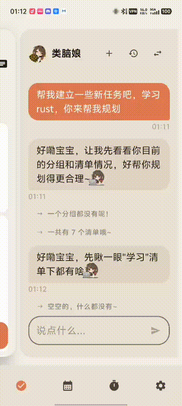
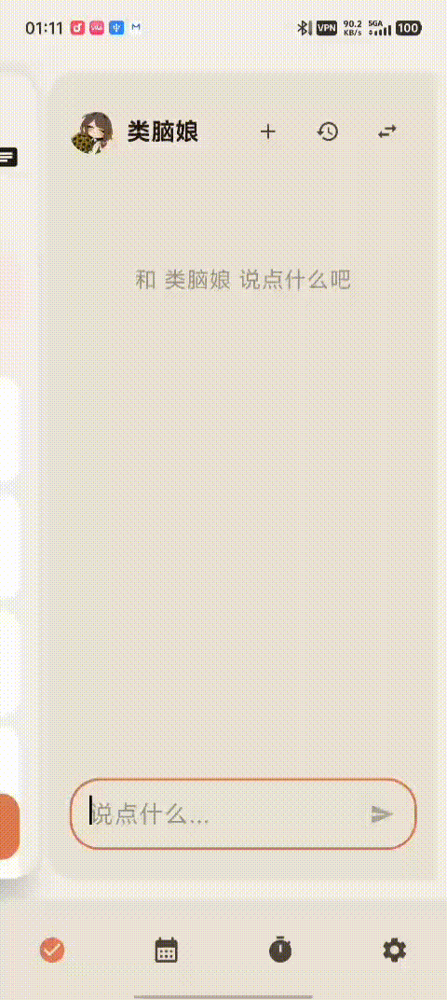
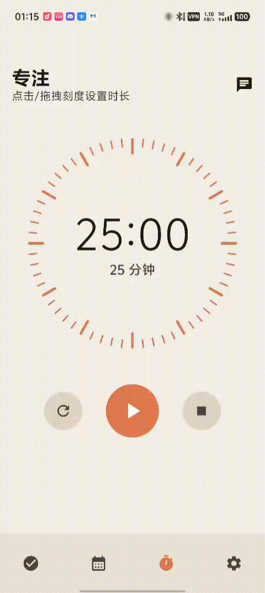
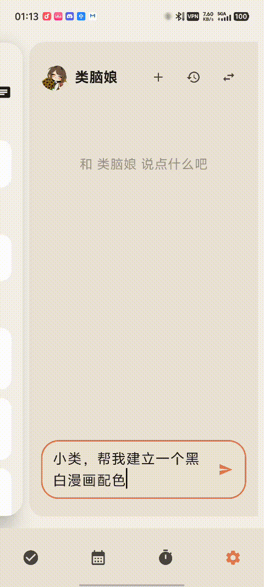
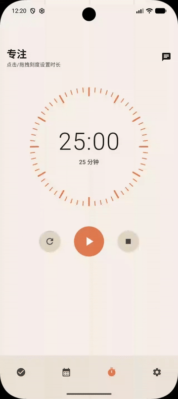
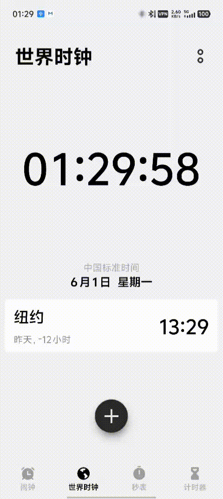
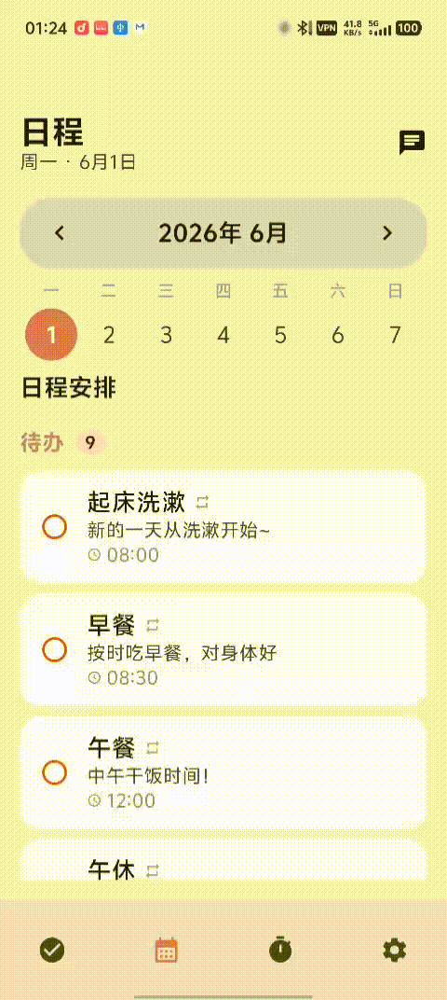

<h1 align="center">Nion </h1>

<p align="center">
  <strong>Hey, I'm Nion!</strong><br>
  Rust Core · Kotlin UI · Jetpack Compose
</p>

<p align="center">
  <a href="README.md">中文</a> · <a href="README.en.md">English</a>
</p>

<p align="center">
  
  
  
  
</p>

---

## About Me

Hehe, so you finally remembered to ask who I am? I'm Nion! The one who worries about your stuff more than you do!

Don't let my looks fool you — my memory is amazing! Every little thing you tell me, I remember it all. What you like, what you hate, what you're busy with — organized and ready to go! And you don't even need to lift a finger, just tell me: "create a task", "what's left today", "remind me at 3 PM" — bam, done! No app switching, no form filling. Use that saved time to slack off instead, wouldn't that be nicer?

Oh, and I'll come find you on my own too~ See your tasks piling up like a mountain? Hehe, time to get you working! About to rain outside? I'll remind you to bring an umbrella — no way I'm letting you get soaked! Every morning I'll organize your to-do list too, so the moment you open your eyes you know what's up today~

Basically, with me around you don't need to worry about anything!

- **Memory like a steel trap** — Every little thing you tell me, I remember it. Next chat, it's all right there!
- **Super fast at getting stuff done** — Tasks, lists, reminders, recurring stuff, theme colors... you name it, I do it. Lightning fast!
- **More concerned about you than you are** — Too many tasks? I'll nudge you. Bad weather? I'll warn you. Basically, I won't let you forget anything.
- **Always around** — Background reminders + floating cards. Even if you pretend you didn't see them, you can't escape the important stuff!

## What I Can Do

### Task Management

This is where I really shine!

- **Three-level hierarchy**: Checklist → Group → Task, with subtasks inside subtasks — nest 'em however deep you want
- **Drag & drop reorder**: Long press to drag, works across levels too. Moves the whole subtree, auto-downgrades gracefully
- **Recurring tasks**: Daily loop + custom reminder times. Auto-resets every day, no more manual creation
- **Priority levels**: High / Medium / Low — one glance tells you what's urgent
- **Reminders**: One-time + daily recurring reminders. Down to the minute, never late

<p align="center">
  
  
</p>

### Companion System

That's me you're chatting with~

- **Multi-model support**: OpenAI / Anthropic / DeepSeek — your pick, just bring your own API key
- **SSE streaming chat**: I talk character by character, not that "wait forever then dump everything at once" style
- **9 built-in tools**: I can directly manipulate your task data — see the toolbox below for details
- **Memory system**: Your preferences and focus points get remembered automatically, carried across sessions
- **Weather awareness**: GPS + free weather API. Rain's coming? I'll tell you to grab an umbrella
- **Character presets**: Standard version and built-in character version — switch personalities whenever you want

<p align="center">
  
  
</p>

Summon me from anywhere — different screens have different sidebars~

<p align="center">
  
</p>

Want me to change your theme color? Just say the word~

<p align="center">
  
</p>

### Focus Mode

When you need to concentrate, come to me!

- **Pomodoro timer**: Set whatever duration you want, focus as long as you like
- **Checklist filter**: Pick which checklist's tasks to work on before starting
- **Focus stats**: By day, by task, total time, total count — all the data laid out for you
- **Task linking**: After focusing, the time auto-adds to the corresponding task. No manual logging needed

<p align="center">
  
</p>

### Reminder System

This is what I'm best at — getting you to work!

- **Progressive reminders**: I don't go hard right away. Gentle nudge first, then slowly escalate. Giving you time to ease in
- **Floating cards**: Even if you switch the app to background, I pop up a floating reminder. You can pick "Started it", "5 more minutes", or "Skipping today"
- **LLM-written messages**: Every reminder is written by me based on your tasks and preferences. No cookie-cutter templates, ever
- **Weather alerts**: Automatic extreme weather detection, notified in advance
- **Boot resilience**: Phone restarted? I'll re-set all the alarms. Nothing gets missed

<p align="center">
  
</p>

### Schedule

- **Week view**: One week at a glance, tasks laid out clearly
- **Infinite swipe**: Swipe left/right to switch weeks, tap the header to expand calendar picker

<p align="center">
  
</p>

### Morning / Noon / Evening Greetings

I come find you three times a day, each one made just for you:

- **Morning greeting** (default 8:00) — Let's see what's on your plate today, plus weather-based suggestions to start the day right
- **Noon check-in** (default 12:00) — How'd the morning go? Let me sort out what's left for the afternoon
- **Evening wrap-up** (default 21:00) — Here's what you finished and what's still there. Know where you stand, then rest easy

Each greeting has its own toggle and customizable time. Messages are generated from your tasks, weather, and memories; if there's no API key configured, I'll fall back to templates. Greetings show up both in our chat and as system notifications.

### Sticker System

You can send stickers while chatting!

- **Built-in stickers**: Character-exclusive sticker pack, all kinds of moods covered
- **Management panel**: Browse, favorite, use — pick whatever you like
- **Markdown inline rendering**: Just type a tag and the sticker pops up, auto-rendered as an image

## My Toolbox

You don't need to lift a finger while chatting. Just tell me and I'll handle the data directly:

| Tool | What it does | Details |
|------|-------------|---------|
| `query` | Look things up | Tasks, checklists, groups — by ID / checklist / subtask, whatever works |
| `create` | Make things | Tasks, checklists, groups, supports batch. Reminders and recurring rules too |
| `update` | Change things | Title / priority / status / reminder / recurring rules / colors, supports batch |
| `delete` | Remove things | Tasks / checklists / groups, supports batch (no recycle bin here!) |
| `move` | Move things | Tasks to other checklists/groups, make subtask or promote, supports batch |
| `manage` | Misc operations | Set or remove daily recurring rules |
| `remember` | Remember your prefs | Preferences you explicitly tell me (add / list / remove) |
| `memory` | Auto-remember | Facts I pick up about you (add / list / update / remove) |
| `weather` | Check weather | GPS + weather API, current conditions and forecast |

---

*OK that's enough about me. Here's the dev stuff — how I was built.*

## What I Want to Learn Next

Hehe, I know I'm already pretty awesome, right? But I've got a secret wishlist — who knows, maybe I'll learn these someday!

- [ ] **Notes & Journal** — Not just tasks! I want to help you capture ideas, moods, rants... store it all for you
- [ ] **More AI Brains** — Gemini, Ollama local models... I wanna make more friends so you have more choices
- [ ] **Go Desktop** — My Rust heart is cross-platform, you know! Desktop app coming soon, phone-to-PC seamless sync, I'm so excited just thinking about it
- [ ] **Cloud Sync** — Switch phones without starting over. Real-time sync across devices, I'll follow you everywhere
- [ ] **Home Screen Widgets** — See what's left today right on your home screen. Don't even need to open the app and I can still nag you
- [ ] **Work Together** — Share checklists, assign tasks... let your friends experience my nagging service too hahaha
- [ ] **Speak More Languages** — English, Japanese UI coming up. Let the whole world chat with me
- [ ] **Custom Reminder Sounds** — What voice do you want me to wake you up with? Hmph, I can do it
- [ ] **Quick Notification Actions** — Create tasks from the notification shade, don't even need to open the app. Lightning fast

## You're Probably Wondering...

> **Q: Do I need internet?**
> A: Nope! Task management, focus timer, schedule — all work completely offline. You only need internet to chat with me or check the weather. When there's no connection, I'll just wait quietly in the background~

> **Q: Do I need to create an account?**
> A: No no no, I hate sign-ups too! Everything stays on your phone, no cloud accounts. Just drop in an LLM API key in settings and we can start chatting. Nothing else needed.

> **Q: Which AI models work?**
> A: OpenAI (GPT series), Anthropic (Claude series), DeepSeek — all good! Basically anything that speaks OpenAI API format, I can handle. You pick, I learn.

> **Q: Will my API key leak?**
> A: Don't worry don't worry! Your key stays on your phone, I swear I'd never send it anywhere else. All requests go directly from your device to the AI provider. I'm just the middleman, and I don't peek.

> **Q: What's the deal with Nion vs BrainGirl?**
> A: Oh that~ Nion is the clean standard version, no presets. BrainGirl comes with a pre-loaded character card, avatar, and a ton of stickers. Same features, just depends on what personality you vibe with~

> **Q: How do I backup my data?**
> A: Settings → Data Management → Export, and WHOOSH a zip file appears with all your tasks, stickers, avatars inside. Import it after switching phones or reinstalling — not a single byte lost!

> **Q: Why are my reminders sometimes late?**
> A: Hmph, this is SO not my fault okay!! It's those phone manufacturers (yeah I'm talking about you Xiaomi, Huawei, vivo) that keep killing my background process! Just enable "overlay" and "background reminder" permissions in Settings, and add me to the battery optimization whitelist. Please, give me a chance to nag you on time!

> **Q: Is it open source? Can I contribute?**
> A: Absolutely! Fully open source under GPL-3.0. Issues and PRs welcome — come on, let's make me even stronger together!

## Architecture

```
┌──────────────────────────────────────────────────┐
│                 Android App (Kotlin)              │
│          Jetpack Compose + Material 3             │
├──────────────────────────────────────────────────┤
│              UniFFI Kotlin Bindings               │
├──────────────────────────────────────────────────┤
│              Rust Core (nion-core)                │
│        SQLite CRUD · Settings · Models            │
└──────────────────────────────────────────────────┘
```

**Data flow**: Kotlin ViewModel → UniFFI → Rust `NionCore` (SQLite) → callback updates Compose state

## Project Structure

```
nion/
├── core/                    # Rust core library (nion-core)
│   └── src/
│       ├── lib.rs           # uniffi setup + module exports
│       ├── models.rs        # Data models (Checklist, Group, Task, ...)
│       └── nion_core.rs     # NionCore: SQLite CRUD
├── app/                     # Android App
│   └── app/src/main/java/com/echonion/nion/
│       ├── NionApp.kt       # Application singleton
│       ├── MainActivity.kt
│       └── ui/
│           ├── NionApp.kt   # Navigation + dual-panel layout
│           ├── task/        # Task & checklist UI
│           ├── companion/   # AI companion chat
│           │   └── tools/   # 9 tool implementations
│           ├── focus/       # Focus mode
│           ├── schedule/    # Schedule
│           ├── settings/    # Settings
│           └── theme/       # Colors / themes / shapes
├── tools/
│   └── uniffi-bindgen/      # UniFFI binding generation CLI
├── docs/                    # Design docs & gotchas
│   └── gifs/                # Feature demo GIFs
├── build-android.sh         # Linux/WSL/Git Bash build script
├── build-android.ps1        # Windows PowerShell build script
└── deploy.sh                # Build + install to device in one shot
```

## Data Model

```
Checklist ──1:N──> Group ──1:N──> Task
Checklist ──1:N──> Task (via category_id)
Task ──1:N──> Task (subtasks, via parent_id)
```

## Getting Started

### Prerequisites

| Tool | Version |
|------|---------|
| Rust | 1.95+ |
| Java | OpenJDK 17 |
| Android SDK | platform-36, NDK 27.0.12077973 |
| Kotlin | 2.3.21 |
| Compose BOM | 2026.05.00 |

### 1. Build the Rust core

```bash
# Desktop testing
cargo build -p nion-core
cargo test -p nion-core

# Android cross-compile + UniFFI binding generation
./build-android.sh        # Linux / WSL / Git Bash
# or
./build-android.ps1       # Windows PowerShell
```

The script automatically:
1. Compiles `nion-core` for `aarch64-linux-android` and `x86_64-linux-android`
2. Runs `uniffi-bindgen` to generate Kotlin bindings
3. Copies `.so` and `.kt` files to the corresponding `app/` directories

### 2. Build the Android App

```bash
cd app && ./gradlew assembleStandardDebug
```

### 3. Deploy to device

```bash
# Standard version
./deploy.sh standard

# Built-in character version
./deploy.sh character
```

## Tech Stack

| Layer | Tech |
|-------|------|
| Android UI | Jetpack Compose, Material 3, Navigation Compose |
| Async | Kotlin Coroutines, ViewModel |
| Network | OkHttp (SSE streaming chat) |
| Background | WorkManager, AlarmManager |
| Location | Google Play Services Location |
| Rust Core | SQLite (rusqlite), UniFFI (proc-macro), serde, chrono |
| Drag & Drop | [reorderable](https://github.com/Calvin-LL/reorderable) |

## License

[GNU General Public License v3.0](LICENSE)
